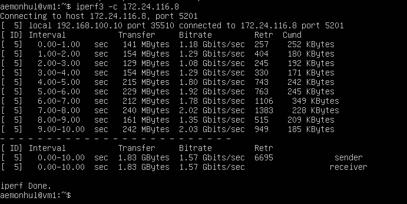

# Part 3 — iperf3 Benchmarking

## 3.1 Connection Speed

- 8 Mbps = 1 MB/s
- 100 MB/s = 800000 Kbps
- 1 Gbps = 1000 Mbps

## 3.2 iperf3 Utility

- Measured connection speed between ws1 and ws2 using iperf3

