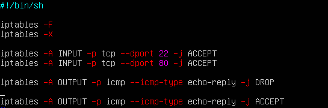
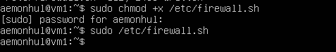
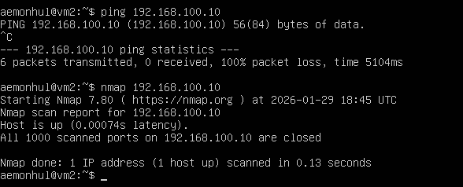

# Part 4 — Firewall

## 4.1 iptables

- Created `/etc/firewall.sh` on ws1 and ws2

- Firewall script content

- Running firewall script

## 4.2 nmap

- Found non-pingable machine using ping
- Verified host is up with nmap

