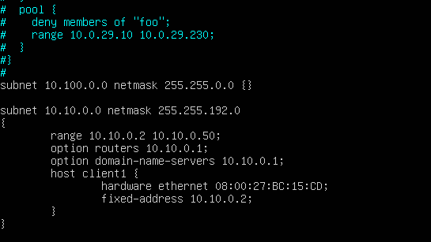
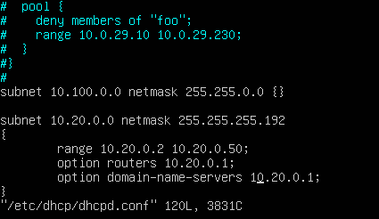
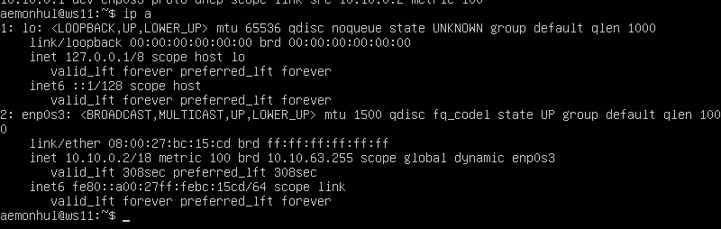
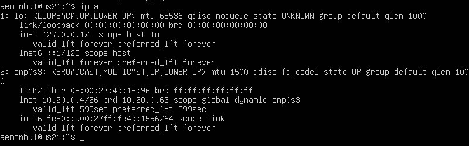

# Part 5 — DHCP

## Router Configuration

### r1 DHCP Server

- DHCP configuration on router r1

- Restarting DHCP service

### r2 DHCP Server

- DHCP configuration on router r2

- Restarting DHCP service

## Workstation Configuration

- ws11 obtaining IP via DHCP

- ws21 obtaining IP via DHCP
