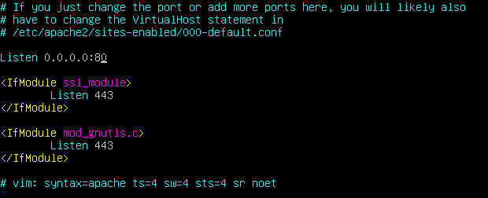
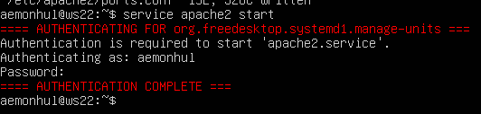
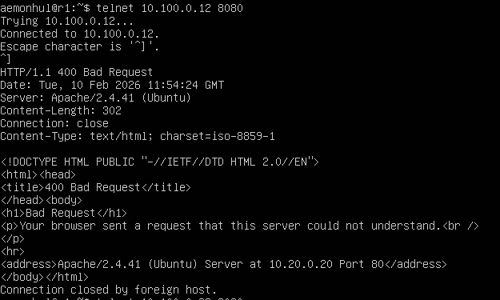
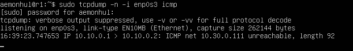
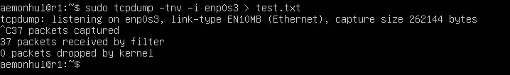

# Part 8 — Apache Web Server

## Installation & Configuration

- Apache ports configuration

- Starting Apache service

## Access from Remote

- Accessing Apache from r1 via telnet

## tcpdump Analysis

- Network traffic capture with tcpdump

- Detailed tcpdump output
